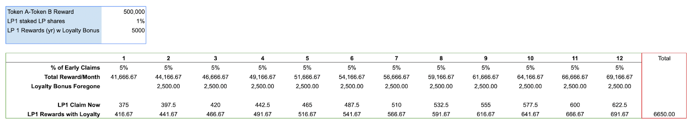

# 激励计划

一个项目可以建立激励计划来吸引更多的流动性，并将其锁定在池子里。更多的流动性意味着更小的滑点和更多的交易，这将为流动性提供者产生更多的交易费用收益，形成一个良性循环。&#x20;

一个项目可以这样配置激励计划&#x20;

* 在一段时期内运行&#x20;
* 每隔x个区块分配一定数量的奖励Token&#x20;
* 流动性提供者将根据他们在资金池中的份额按比例获得奖励 激
* 励计划可以包括多个奖励Token&#x20;

## 忠诚奖励&#x20;

项目可以配置带有忠诚奖励的激励计划：

* 可以避免挖矿后的大量抛盘，为了协议以及整个网络考虑，实现了更加可持续的和更长期的挖矿
* 为长期的流动性提供商提供更丰厚的回报&#x20;

### 忠诚奖励如何运作？&#x20;

项目可以设置一个忠诚奖励比例，例如：40%

* 流动性提供者需要将奖励Token保留在池中，直到计划结束才能获得奖励
* 如果一个流动性提供者提前领取奖励代币，那么它的奖金将重新被添加回到奖励池中，由其他流动性提供者分享。&#x20;
* 长期的流动性提供者可能会得到比标准奖励更高的奖励&#x20;

### 例子&#x20;

让我们为A Token-aUSD池建立一个奖励计划 ：

* 奖励总额：100,000个A Token&#x20;
* 计划持续时间：12个月内&#x20;
* 忠诚度奖励：10%（基本奖励为90,000，忠诚度奖励为10,000）&#x20;
* 有5%的流动性提供者会提前提取他们的奖励（在计划结束前）
* 流动性供应商1（LP1）拥有资金池的1%。

这导致&#x20;

* 如果 LP1 质押并将奖励保留在资金池中直到计划结束，LP1 将获得至少 5,000 个Token奖励&#x20;
* 5%的LP提前领取他们的奖励并放弃他们的忠诚奖励，所以2,500个代币（=500,000\*10%\*5%）被退回到资金池中，由其他LP共享。&#x20;
* **LP1持有他/她的奖励的时间越长，他/她也将获得更多的奖励，因为其他人放弃的忠诚度奖励会被添加到奖励池中**。&#x20;
  * 如果LP1立即领取奖励，那他/她将放弃10%的奖金，获得375个Token（=41,666.671%\*90%）。&#x20;
  * 如果LP1在第5个月领取奖励，即使他/她放弃了10%的奖金，他/她仍获得更多的奖励，即465 Token。&#x20;
* 由于其他LP放弃了他们的忠诚奖金，如果LP1坚持到最后，LP1有可能在年底获得总共6,650个Token的奖励。&#x20;

当然，这是一个过于简化的例子，在现实中，流动性提供者的LP份额很可能由于整体流动性的增加或减少而波动，从而导致某些时期的奖励增加或减少。
