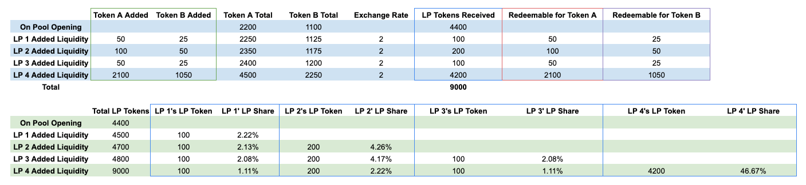

# 流动池

## 恒定乘积

AcalaSwap的设计是受到了Uniswap的“恒定乘积公式”启发。交易率曲线可以定义为如下公式：

$$
x * y = k
$$

x代表A token的总数，y代表B token的总数，在任何时候，展示的汇率是x/y.

$$
B_o = y-(y*x/(x+A_i))=y*A_i/(x+A_i)
$$

池子的流动性越大（x和y越大），将A token换成B token时对价格的影响越小。

$$
Slippage = B_o/y
$$

每笔交易的交易费确实让常数K增加了，并根据LP们在资金池中的份额均摊。一般来说，资金池中的流动性越大（TVL），特定交易对汇率的影响就越小（因此滑点就越小）。交易量就成了赚取交易费用很好的指标。

## 前端运行细节 & 漏洞保护

<mark style="color:red;">少图</mark>

#### 交易员

AcalaSwap为可交换的token设置了保护性上限，以防止潜在的漏洞，比如来自前端的漏洞

* **兑换**：交易员可以输入A token的数量，以及收到的B token的最小数量。
* **与精准的目标token兑换**：交易者可以输入需要输出的B token的数量以及输入A token的最大数量

流动性提供商

AcalaSwap为注入和提取流动性增加了一个保护性上限，这在一定程度上防止了漏洞。

* **注入流动性**：交易员将收到的LP份额的最低目标数量&#x20;
* **提取流动性**：交易员可赎回的A和B代币的最低目标数量

## 交易范例

.png>)

* 用户2兑换1000 token A (=Token A总量的20%)
  * 这对汇率有很大的影响，导致滑点很高
  * 相对于交易规模，资金池中的流动性越强（TVL越高），滑点越低
* 用户1兑换500 token A 使用 `swapWithExactSupply`
  * 交易费用以可选token (Token A)支付: 500\*0.3% = 1.5
  * 实际收到的token B, 考虑到改变后的恒定产品，有上述公式给出 = 2250-(4500\*2250/(4500+500-1.5)) = 224.39
  * 滑点 = 9.97%
  * 交易后的汇率 = 5000/2025.6077 = 2.4684

经历四次交易后

* 流动性提供商1仍有100个LP代币，相当于1.11%的LP份额
* 流动性提供商1赚取了0.05代币A和0.01667代币B&#x20;
* 由于汇率已经从2偏离到2.1165，因此存在无常损失。&#x20;
* 然而，该损失只有在流动性提供者撤回其流动性时才会实现。

## 注入流动性范例

假设资金池以2,200个代币A和1,100个代币B开启，随后一些流动性提供者增加了流动性。

* 流动性提供商 1 注入50个Token A和25个Token B
  * 当前汇率 = 2
  * LP tokens = 50\*1 + 25 \*2 = 100
*   LP 份额, 作为LP贡献流动性的占比，随着新流动性的注入而不断变化&#x20;

    * 流动性提供商1的LP份额 = 100/4500 = 2.22%

## 无常损失

然而，作为流动性提供者存在各种风险，特别是当基础资产汇率出现大幅波动时，这可能导致LP的情况比单纯持有代币更糟。&#x20;

如果底层代币的兑换率与LP提供流动性时的兑换率相背离，那么与单纯持有代币相比，就存在潜在损失。兑换率的偏差越大，潜在的损失就越大。当然，这种损失只有在LP提取其流动性时才会实现。而这就被称为无常损失。&#x20;

这篇有深度的文章对无常损失进行了深入分析。&#x20;

在实践中，LP的实际收益是资金池上每笔交易的累计费用，对LP的累计稳定费奖励以及无常损失的总和。
